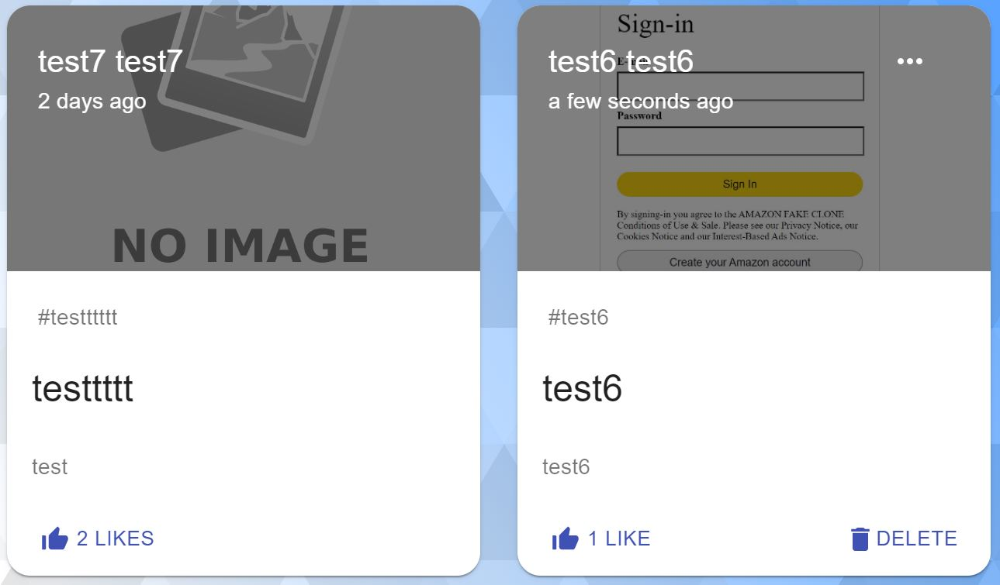
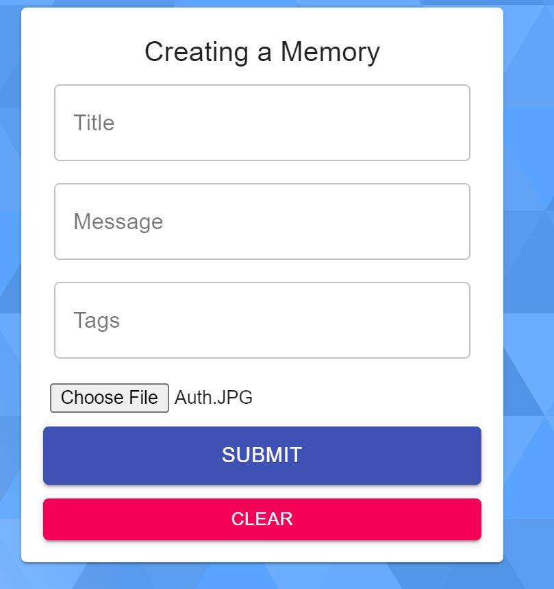

# Memories App - (RESTful backend)

A social media web-app for post memories and interacting with other people [Live Link](https://jeffdeng-memories-app.netlify.app/)

## Description

The is a MERN stack social media app.

**The app has two branches, master branch is built with RESTful API while dev branch is built with GraphQL.**

The purpose of this project is to practice and enhance my full-stack development skills, especially react, node.js, MongoDB, and GraphQL.

## Relevant Techs

### Front-End:

- React
- Redux
- MaterialUI

### Back-End:

- node.js
- Express
- MongoDB

### Tools:

- JWT and bcrypt
- Google OAuth
- GrapQL(dev branch)

## Key Features

- Authentication & Authorization

  

- CRUD posts

  

  

- Fully responsive with the help of MaterialUI

- GraphQL query to enhance performance(dev branch)

## Challenges

- It did cost me some times to figure out how token works as authorization, but I am now feel more confident with it.

- Migrate from RESTful to GraghQL is a bit tricky. At the dev branch, I now using GraphQL mixed with redux state management, the future steps would be removing redux and use GraphQL cache to further improve performance.
